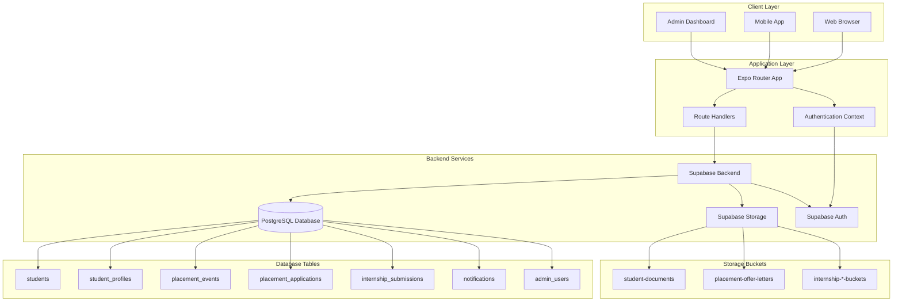
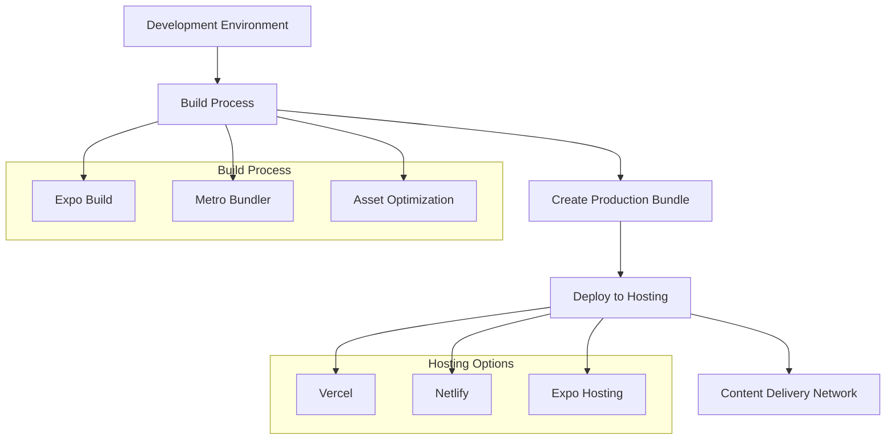
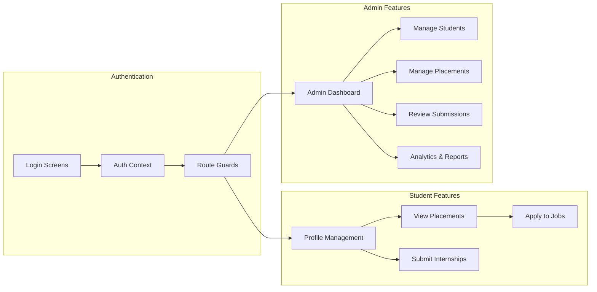
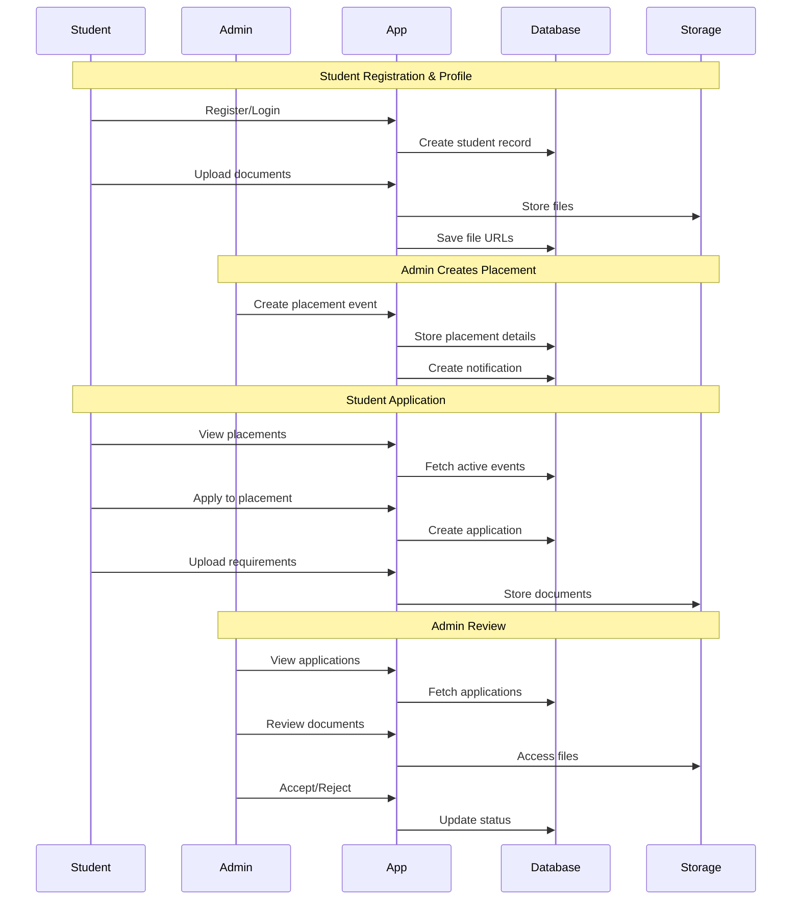
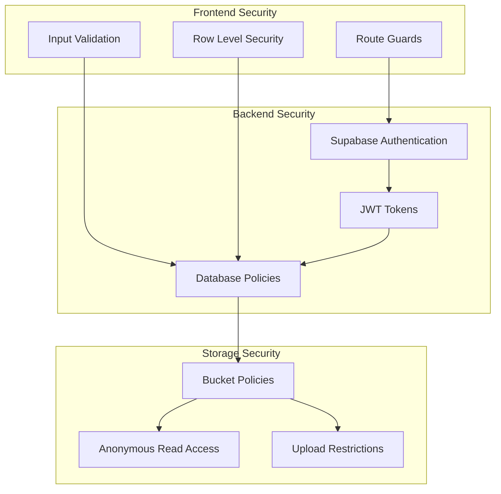
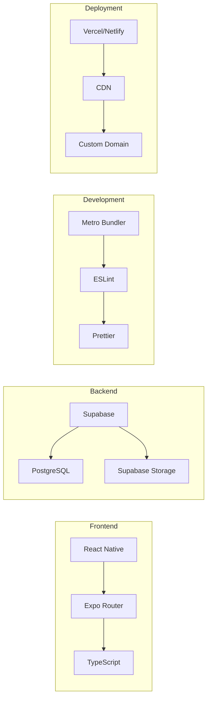

# Campus Connect - Deployment Diagram

## System Architecture Overview

```mermaid
graph TB
    subgraph "Client Layer"
        WEB[Web Browser]
        MOB[Mobile App]
        ADMIN[Admin Dashboard]
    end

    subgraph "Application Layer"
        EXPO[Expo Router App]
        AUTH[Authentication Context]
        ROUTES[Route Handlers]
    end

    subgraph "Backend Services"
        SUPABASE[Supabase Backend]
        DB[(PostgreSQL Database)]
        STORAGE[Supabase Storage]
        AUTH_SVC[Supabase Auth]
    end

    subgraph "Database Tables"
        STUDENTS[students]
        PROFILES[student_profiles]
        PLACEMENTS[placement_events]
        APPLICATIONS[placement_applications]
        INTERNSHIPS[internship_submissions]
        NOTIFICATIONS[notifications]
        ADMINS[admin_users]
    end

    subgraph "Storage Buckets"
        DOCS[student-documents]
        OFFERS[placement-offer-letters]
        INTERN_DOCS[internship-*-buckets]
    end

    WEB --> EXPO
    MOB --> EXPO
    ADMIN --> EXPO
    
    EXPO --> AUTH
    EXPO --> ROUTES
    
    AUTH --> AUTH_SVC
    ROUTES --> SUPABASE
    
    SUPABASE --> DB
    SUPABASE --> STORAGE
    SUPABASE --> AUTH_SVC
    
    DB --> STUDENTS
    DB --> PROFILES
    DB --> PLACEMENTS
    DB --> APPLICATIONS
    DB --> INTERNSHIPS
    DB --> NOTIFICATIONS
    DB --> ADMINS
    
    STORAGE --> DOCS
    STORAGE --> OFFERS
    STORAGE --> INTERN_DOCS
```

## Deployment Flow

```mermaid
flowchart TD
    DEV[Development Environment] --> BUILD[Build Process]
    BUILD --> BUNDLE[Create Production Bundle]
    BUNDLE --> DEPLOY[Deploy to Hosting]
    DEPLOY --> CDN[Content Delivery Network]
    
    subgraph "Build Process"
        EXPO_BUILD[Expo Build]
        METRO[Metro Bundler]
        ASSETS[Asset Optimization]
    end
    
    subgraph "Hosting Options"
        VERCEL[Vercel]
        NETLIFY[Netlify]
        EXPO_HOST[Expo Hosting]
    end
    
    BUILD --> EXPO_BUILD
    BUILD --> METRO
    BUILD --> ASSETS
    
    DEPLOY --> VERCEL
    DEPLOY --> NETLIFY
    DEPLOY --> EXPO_HOST
```

## Component Architecture

```mermaid
graph LR
    subgraph "Authentication"
        LOGIN[Login Screens]
        CONTEXT[Auth Context]
        GUARDS[Route Guards]
    end
    
    subgraph "Student Features"
        PROFILE[Profile Management]
        PLACEMENTS_S[View Placements]
        INTERNSHIPS_S[Submit Internships]
        APPLY[Apply to Jobs]
    end
    
    subgraph "Admin Features"
        DASHBOARD[Admin Dashboard]
        STUDENTS_M[Manage Students]
        PLACEMENTS_M[Manage Placements]
        INTERNSHIPS_M[Review Submissions]
        ANALYTICS[Analytics & Reports]
    end
    
    LOGIN --> CONTEXT
    CONTEXT --> GUARDS
    GUARDS --> PROFILE
    GUARDS --> DASHBOARD
    
    PROFILE --> PLACEMENTS_S
    PROFILE --> INTERNSHIPS_S
    PLACEMENTS_S --> APPLY
    
    DASHBOARD --> STUDENTS_M
    DASHBOARD --> PLACEMENTS_M
    DASHBOARD --> INTERNSHIPS_M
    DASHBOARD --> ANALYTICS
```

## Data Flow Diagram

```mermaid
sequenceDiagram
    participant S as Student
    participant A as Admin
    participant APP as App
    participant DB as Database
    participant ST as Storage
    
    Note over S,ST: Student Registration & Profile
    S->>APP: Register/Login
    APP->>DB: Create student record
    S->>APP: Upload documents
    APP->>ST: Store files
    APP->>DB: Save file URLs
    
    Note over A,ST: Admin Creates Placement
    A->>APP: Create placement event
    APP->>DB: Store placement details
    APP->>DB: Create notification
    
    Note over S,ST: Student Application
    S->>APP: View placements
    APP->>DB: Fetch active events
    S->>APP: Apply to placement
    APP->>DB: Create application
    S->>APP: Upload requirements
    APP->>ST: Store documents
    
    Note over A,ST: Admin Review
    A->>APP: View applications
    APP->>DB: Fetch applications
    A->>APP: Review documents
    APP->>ST: Access files
    A->>APP: Accept/Reject
    APP->>DB: Update status
```

## Security Architecture

```mermaid
graph TB
    subgraph "Frontend Security"
        RLS[Row Level Security]
        AUTH_GUARD[Route Guards]
        VALIDATION[Input Validation]
    end
    
    subgraph "Backend Security"
        SUPABASE_AUTH[Supabase Authentication]
        JWT[JWT Tokens]
        POLICIES[Database Policies]
    end
    
    subgraph "Storage Security"
        BUCKET_POLICIES[Bucket Policies]
        PUBLIC_ACCESS[Anonymous Read Access]
        UPLOAD_RESTRICTIONS[Upload Restrictions]
    end
    
    AUTH_GUARD --> SUPABASE_AUTH
    VALIDATION --> POLICIES
    RLS --> POLICIES
    
    SUPABASE_AUTH --> JWT
    JWT --> POLICIES
    
    POLICIES --> BUCKET_POLICIES
    BUCKET_POLICIES --> PUBLIC_ACCESS
    BUCKET_POLICIES --> UPLOAD_RESTRICTIONS
```

## Technology Stack

```mermaid
graph LR
    subgraph "Frontend"
        REACT[React Native]
        EXPO[Expo Router]
        TYPESCRIPT[TypeScript]
    end
    
    subgraph "Backend"
        SUPABASE[Supabase]
        POSTGRESQL[PostgreSQL]
        STORAGE_SVC[Supabase Storage]
    end
    
    subgraph "Development"
        METRO[Metro Bundler]
        ESLINT[ESLint]
        PRETTIER[Prettier]
    end
    
    subgraph "Deployment"
        VERCEL[Vercel/Netlify]
        CDN[CDN]
        DOMAIN[Custom Domain]
    end
    
    REACT --> EXPO
    EXPO --> TYPESCRIPT
    
    SUPABASE --> POSTGRESQL
    SUPABASE --> STORAGE_SVC
    
    METRO --> ESLINT
    ESLINT --> PRETTIER
    
    VERCEL --> CDN
    CDN --> DOMAIN
```